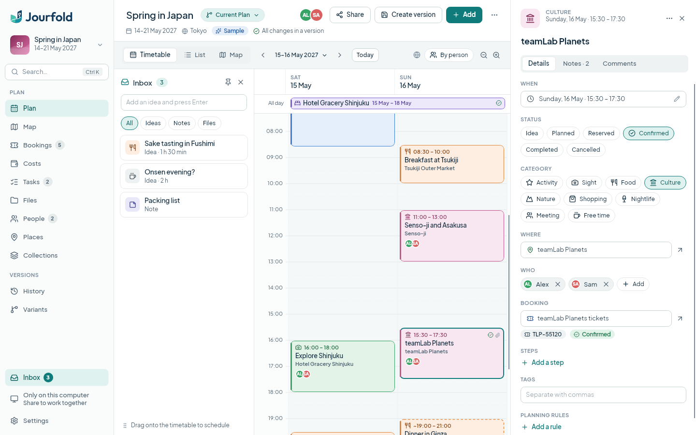
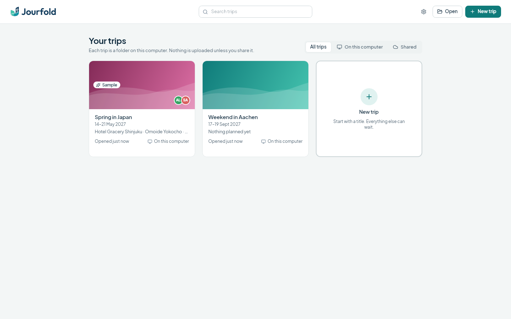
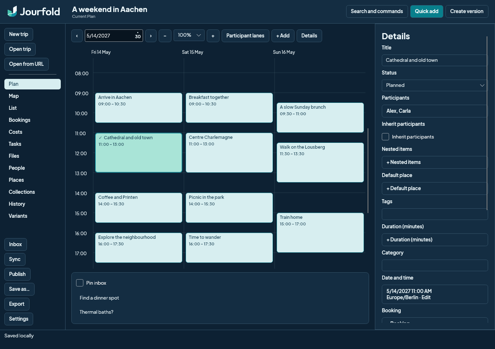

# Jourfold

A desktop travel planner for Windows and Linux, built with Avalonia on the open TravelRepo format. Every trip is an ordinary folder with readable YAML files and full Git history, so it stays usable with or without Jourfold. GPL-3.0-or-later.



## What it does

- **Plan days on a timetable.** Drag across the grid to add an activity, drag blocks to move them and their lower edge to change the duration. Stays and all-day plans sit in a strip above the grid. Times stay correct across timezones and daylight-saving changes.
- **Collect ideas first.** The Inbox holds activities without a time, notes and files. Drag them onto the timetable when you know when.
- **See the trip as a list or on a map.** The map works offline with coordinates you enter. A street map and address search from OpenStreetMap are available after you turn them on.
- **Keep the details together.** Bookings with references and prices, costs per currency with budgets, tasks, files, people, places and collections.
- **Try alternatives.** Variants let you plan a cheaper or slower version, compare it day by day and merge the parts you like. Conflicts are resolved in plain language.
- **Record versions and share.** Create a version with a suggested description of what changed. Publish privately to GitHub or any Git server; Jourfold syncs in the background and merges compatible changes automatically.
- **Export** a day-by-day PDF, a calendar file or a printable web page.
- **Plan with an AI assistant.** Assistants that support MCP, including local ones, can read and change a trip through Jourfold. Their changes are checked like your own and appear in the open trip within seconds.

No account is needed and nothing leaves your computer unless you share a trip or turn on online maps. There are no analytics.

| Library | Dark theme |
| --- | --- |
|  |  |

More captures, including the map, costs, Quick Add, settings and the About window, are in [docs/screenshots.md](docs/screenshots.md). They are taken from the real application with synthetic data.

## Install

Once a release is published, one command installs Jourfold for your user account.

Linux (x86-64 and ARM64):

```sh
curl -fsSL https://github.com/travelrepo-org/jourfold/releases/latest/download/install.sh | bash
```

Windows 10 and 11, in PowerShell:

```powershell
irm https://github.com/travelrepo-org/jourfold/releases/latest/download/install.ps1 | iex
```

Both scripts pick the x64 or ARM64 build and verify the download against the release checksums. Run them again to update. [Installing Jourfold](docs/install.md) covers options, uninstalling and how to read the script before running it.

## Try it

The Linux archive includes the .NET runtime. See [testing on another Linux PC](docs/try-linux.md). On first start, choose **Explore a sample trip** to look around, or **Plan a trip** to start your own.

The [user guide](docs/user-guide.md) explains the main workflows.

## Development

Requires .NET SDK 10.0.401, Git and Python 3. Place TravelRepo at `../travelrepo` for workspace builds.

```sh
dotnet build Jourfold.sln
dotnet test Jourfold.sln
dotnet run --project src/Jourfold.Desktop
```

See [build and test instructions](docs/development.md), [release smoke checklist](docs/release-smoke.md), [provider setup](docs/providers.md) and [plugin API](docs/plugins.md).

This is an implementation build, not an accepted v1 release. [Acceptance status](docs/acceptance.md) records what has been verified and what remains.
