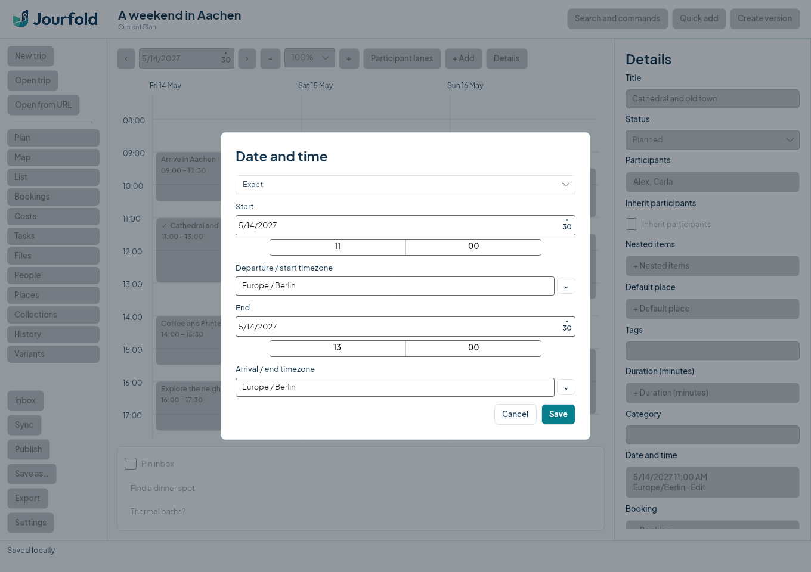
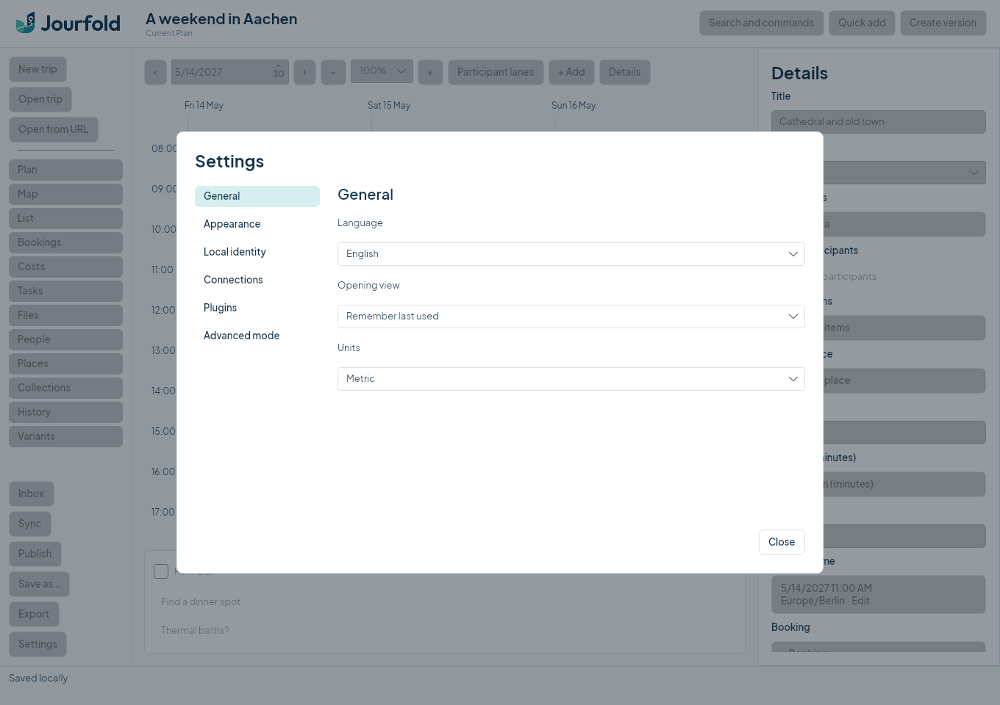

# README screenshots

The README images show the real `App`, `MainWindow` and planning controls, rendered by Avalonia Headless with Skia. They are application captures without operating-system window decorations. They do not demonstrate native file dialogs, desktop integration or screen-reader behavior.

The capture tool creates a disposable TravelRepo containing a synthetic Aachen weekend for Alex and Carla. These are sample ideas, not bookings or travel recommendations. It opens that repository in Jourfold, selects an activity, opens the Inbox, scrolls to daytime hours and saves both themes. The fixture is confined to this documentation tool; it is not seeded into normal application sessions.

## Regenerate

From the Jourfold repository, with .NET SDK 10.0.401, Git 2.34 or newer and the sibling TravelRepo checkout:

```sh
dotnet restore eng/Screenshots/Screenshots.csproj --locked-mode
dotnet run --project eng/Screenshots -c Release --no-restore -- docs/screenshots
```

The tool writes `planning-light.png`, `planning-dark.png`, `settings.png` and `date-time.png` at 1360 × 960 pixels. It uses temporary trip/settings directories and process-local Git configuration. On Linux it isolates the session bus so it cannot use the desktop keyring. No GitHub App, login, remote repository or display server is needed. The temporary fixture is removed after capture.

Open both PNG files and check the timetable, selected activity, Inbox, text and theme before including them in a change. Commit the PNGs with the frontend change and update README captions if their meaning changes. Do not paint over, replace or fabricate interface elements in the captures.

The standalone tool is not part of the solution's default test suite or CI. Its project and dependency lock are checked in so contributors can refresh the images locally. The current capture was verified on Ubuntu; native platform acceptance is recorded separately in [the acceptance matrix](acceptance.md).

## Forms




