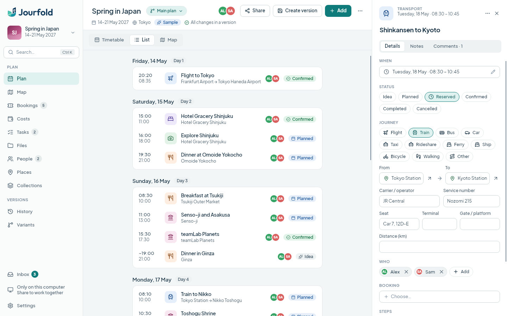
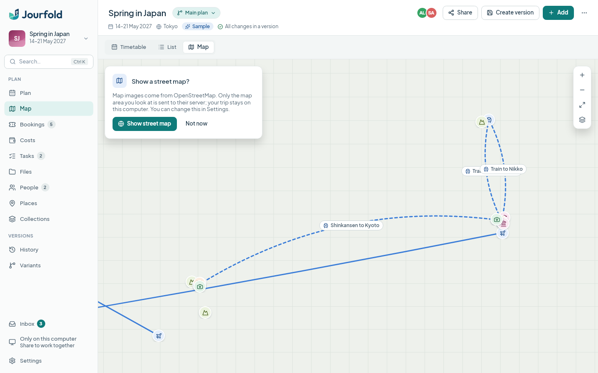
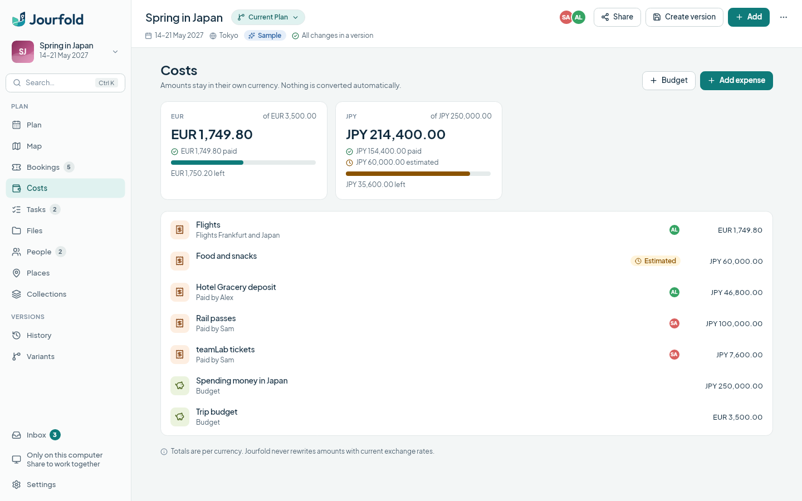
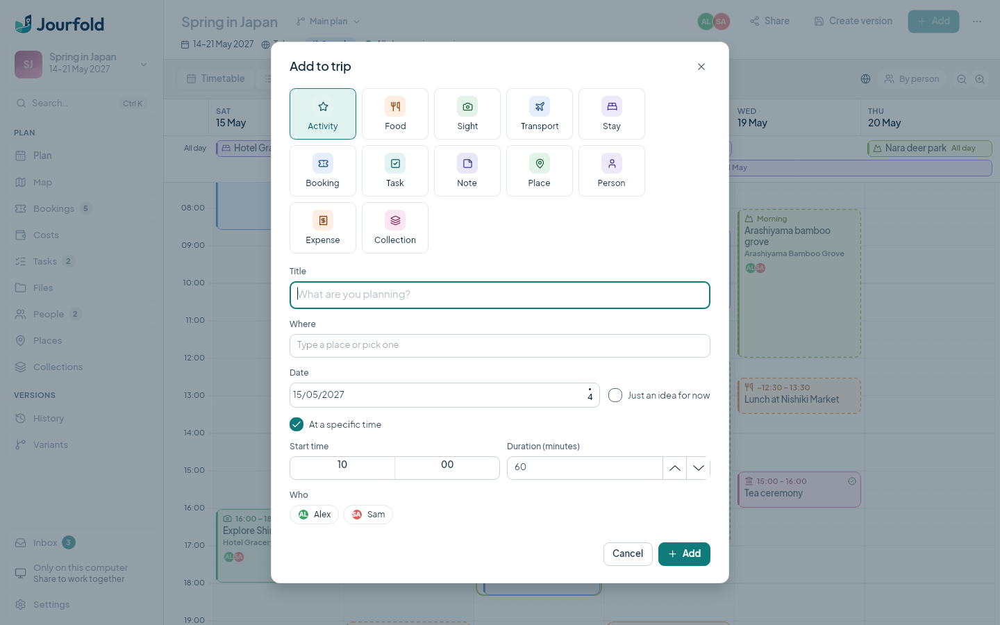
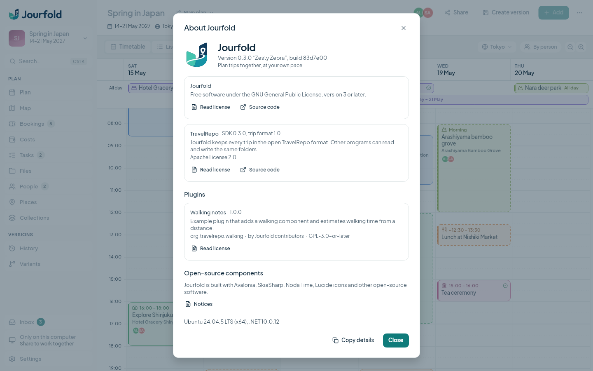

# Screenshots

These images are captures of the real `App` and `MainWindow`, rendered by Avalonia Headless with Skia. They have no operating-system window frame and do not show native file dialogs, popups, desktop integration or screen-reader behaviour.

The capture tool creates the same sample trip that **Explore a sample trip** offers in the application ("Spring in Japan", fixed to May 2027 for repeatable images) and an empty "Weekend in Aachen" trip. Place names are real; times, bookings, references and prices are invented. Everything is written to a temporary directory with its own settings and Git configuration and removed afterwards. No network service is contacted; the map shows the offline view with its opt-in prompt.

## Regenerate

From the Jourfold repository, with .NET SDK 10.0.401, Git 2.34 or newer and the sibling TravelRepo checkout:

```sh
dotnet restore eng/Screenshots/Screenshots.csproj --locked-mode
dotnet run --project eng/Screenshots -c Release --no-restore -- docs/screenshots
```

This writes the nine images below at 1440 × 900 pixels. Two options help when checking changes:

- `--all` adds every main view, dialogs (palette, schedule editor, share, Create Version, new trip, the open-source notices, Connect an AI assistant), variants with comparison and conflict resolution, plus `itinerary.pdf` and `itinerary.html`. Use it with a scratch directory, not `docs/screenshots`.
- `--lang de` captures the German interface.

Open the images and check text, clipping, theme and selection before committing them. Do not edit or retouch captures.

## Captures

The timetable with the Inbox and the inspector, in light and dark themes:


The trip library:


The day-by-day list:



The map before online maps are enabled. Places and routes come from the trip's own coordinates:



Costs per currency with budgets:



Quick Add:



Settings:


About Jourfold, with the example plugin loaded:


